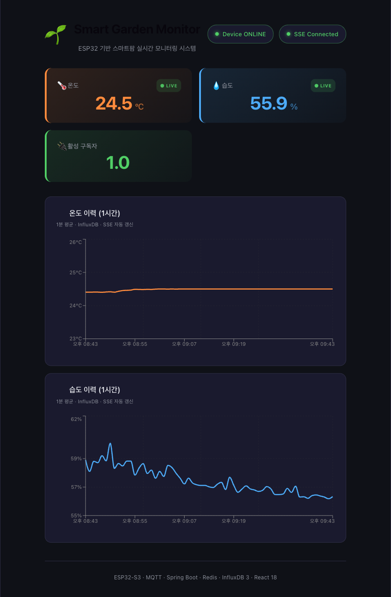
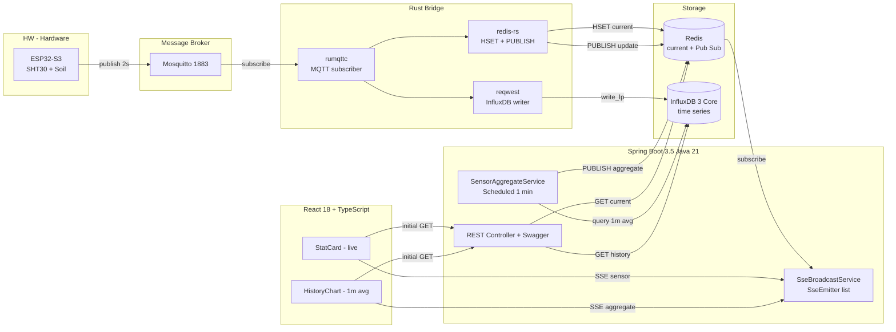
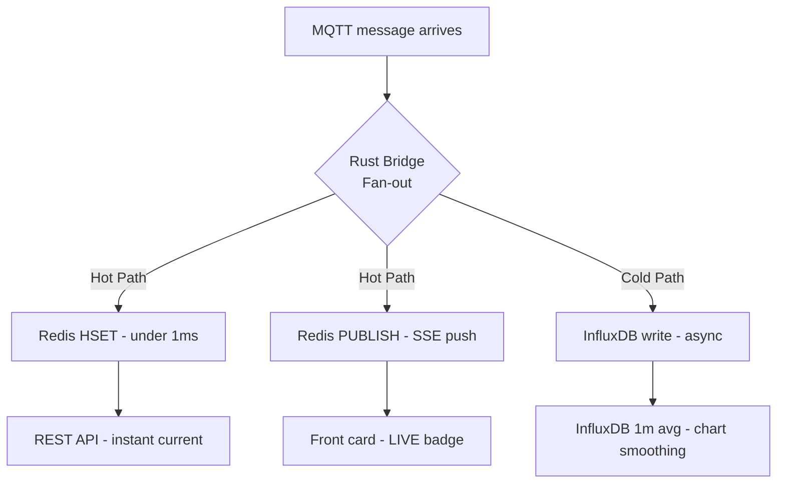
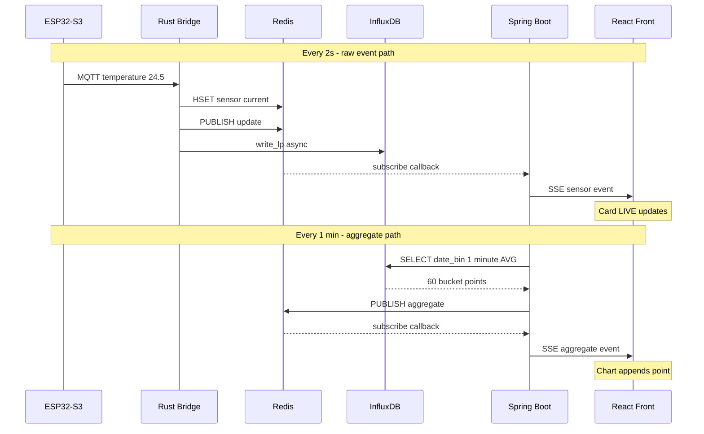

# 🌱 Smart Garden — IoT 풀스택 모니터링 시스템

> ESP32-S3 + Spring Boot 3.x + React 18 으로 만든 **스마트팜 미니 프로토타입**
> MQTT · Redis · InfluxDB 3 · SSE 를 활용한 실시간 + 시계열 이중 파이프라인



---

## 📌 이 프로젝트에 대해

집에서 식물을 키우면서 **"왜 자꾸 말려 죽일까"** 라는 단순한 문제에서 시작했지만,
단순 알림 앱이 아니라 **스마트팜 시스템에 들어갈 만한 데이터 파이프라인** 을 직접 구성해 보고 싶었습니다.

ESP32-S3 + 온습도 센서 + 토양 센서 → MQTT 브로커 → Spring Boot 백엔드 → 이중 저장소(Redis + InfluxDB)
→ React 대시보드로 이어지는 **End-to-End IoT 풀스택** 을 한 사람이 만들 수 있는 가장 작은 단위로 압축했습니다.

채용 도메인이 **스마트팜** 인 점을 고려해, 회사가 실제로 다루는 기술 스택과
패턴을 의도적으로 맞춰서 구성했습니다 (Java 21 / Spring Boot 3 / React 18 / TypeScript / MQTT IoT).

---

## 🤖 AI 활용에 대한 명시

이 프로젝트의 **백엔드/프론트엔드 코드는 Anthropic Claude (Claude Code) 와의 페어 프로그래밍으로 작성** 되었습니다. 정직성을 위해 미리 밝혀둡니다.

**제가 직접 결정/수행한 부분:**

- **하드웨어 구성** — ESP32-S3 보드 + SHT30 온습도 센서 + 정전식 토양 수분 센서 v2.0 의 배선과 캘리브레이션
- **인프라 재구성** — 이전부터 다뤄오던 MQTT(Mosquitto), Redis, InfluxDB, Tailscale 등을 이번 IoT 파이프라인 목적에 맞게 재조합
- **아키텍처 설계** — Hot path / Cold path 분리, Redis Pub/Sub 기반 SSE fan-out, 1분 단위 집계로 차트 노이즈 제거 등 구조 결정
- **문제 정의와 디버깅** — 차트 노이즈 원인 파악 → 다운샘플링 도입, 센서 접촉 불량 → 핀 변경과 raw 전압 디버깅 등

요약하면 **"무엇을, 왜, 어떻게 만들 것인가"의 설계는 본인이 수행했고, 코드 작성 효율을 위해 AI를 활용한** 형태입니다.

---

## 🏗 아키텍처

### 전체 데이터 흐름



### Hot Path vs Cold Path 분리



**핵심**: 실시간 경로(Hot path)에 DB 쓰기를 끼워 넣지 않습니다.
DB 장애가 생겨도 SSE 실시간 push 는 계속 동작합니다.

### 두 종류의 SSE 이벤트



---

## 🛠 기술 스택

### Backend
| 영역 | 기술 |
|------|------|
| 언어/런타임 | **Java 21 LTS** (OpenJDK) |
| 프레임워크 | **Spring Boot 3.5.4** |
| MQTT | Spring Integration MQTT + Eclipse Paho |
| 캐시/메시징 | **Spring Data Redis** (Pub/Sub + StringRedisTemplate) |
| 시계열 DB | **InfluxDB 3 Core** + 공식 Java Client (Flight SQL) |
| 실시간 푸시 | **Server-Sent Events** (`SseEmitter`) |
| API 문서 | **SpringDoc OpenAPI 2.6** (`/swagger-ui.html`) |
| 빌드 | Gradle 8.14 |
| 부가 | Lombok, Jackson, Spring Validation |

### Frontend
| 영역 | 기술 |
|------|------|
| 언어/런타임 | **TypeScript 5** + Node 22 |
| 프레임워크 | **React 18** (Vite 8) |
| 서버 상태 | **TanStack Query v5** |
| 차트 | **Recharts** (시계열 LineChart) |
| 실시간 | **EventSource (SSE)** — 네이티브 |
| HTTP | Axios |
| 스타일 | CSS 변수 기반 다크 테마 |

### IoT / Firmware
| 영역 | 기술 |
|------|------|
| MCU | **ESP32-S3-WROOM-1** (Xtensa LX7 듀얼코어, Wi-Fi + BLE 5.0) |
| 센서 | SHT30 (I2C 온습도), 정전식 토양 수분 v2.0 (ADC) |
| 펌웨어 | **ESPHome** (YAML 기반, OTA 업데이트 지원) |
| 통신 | MQTT QoS 0, 2초 주기 publish |

### Infrastructure
| 영역 | 기술 |
|------|------|
| MQTT 브로커 | **Mosquitto** (맥미니 상시 운영) |
| 캐시 / 이벤트 버스 | **Redis** |
| 시계열 | **InfluxDB 3 Core** (`--without-auth`, Flight SQL) |
| 원격 접근 | **Tailscale** (개발 중 SSH 터널) |

---

## 🎯 주요 설계 결정

### 1. 왜 Redis와 InfluxDB를 동시에 썼는가?

서로 다른 질문에 답하는 도구이기 때문입니다.

- **Redis** = "**바로 지금** 의 값을 알려줘" → key-value, < 1ms
- **InfluxDB** = "**지난 1시간 동안의 추이** 를 보여줘" → 시계열, 집계 지원
- **SSE** = "지금부터 값이 바뀌면 알려줘" → 이벤트 스트림

이 세 가지를 분리해서 각각 최적화된 스토리지로 처리하는 게 **CQRS / 이벤트 소싱** 의 고전 패턴입니다.

### 2. 왜 SSE 인가? WebSocket 이 아니라?

**적절한 도구를 고르는 게 핵심.**

| | WebSocket | SSE |
|---|-----------|-----|
| 방향 | 양방향 | 서버 → 클라이언트 |
| 자동 재연결 | 직접 구현 | 브라우저 기본 |
| HTTP 호환 | ❌ (별도 ws://) | ✅ (Authorization 헤더 등 그대로) |
| 센서 데이터에 적합한가 | 과잉 | **딱 맞음** |

센서 데이터는 서버 → 클라이언트 단방향 푸시면 충분합니다.
**더 단순한 솔루션을 의도적으로 선택한 결정** 입니다.

### 3. 왜 Redis Pub/Sub 으로 한 번 더 fan-out 하는가?

수평 확장(horizontal scale) 대비입니다.

```
인스턴스 1대일 때:    MqttHandler → 인메모리 SseEmitter 리스트
인스턴스 N대일 때:    MqttHandler → Redis PUBLISH → 모든 인스턴스가 SUBSCRIBE
                                                 → 각자의 로컬 SseEmitter 들에게 push
```

`SseEmitter` 자체는 살아있는 HTTP 연결이라 직렬화할 수 없습니다 → 인메모리에 둬야 함.
대신 **이벤트 fan-out 만 Redis로** 하면 인스턴스 추가에 코드 변경 없이 대응 가능.

### 4. 왜 그래프는 1분 단위 집계인가?

ESP32 가 2초마다 보내면 1시간에 1800개 포인트 → 차트가 노이즈로 가득 찹니다.
**InfluxDB 의 `date_bin('1 minute', time)` + `AVG(value)`** 로 다운샘플링하면:

- 데이터 1800개 → 60개 (30배 압축)
- 센서 노이즈 ±0.1°C 가 평탄화되어 추세가 잘 보임
- 시계열 DB 의 표준 기법(다운샘플링)을 실제로 적용

### 5. 왜 차트도 SSE 로 자동 갱신되는가?

스마트팜 모니터링은 사용자가 페이지를 **계속 띄워 두고 보는 화면** 입니다.
새로고침 없이 자동 업데이트되어야 운영이 자연스러워요.

이 시스템은 SSE 로 **두 종류의 이벤트** 를 송신합니다:

| 이벤트 | 주기 | 용도 |
|--------|------|------|
| `sensor` | 매 2초 (raw) | 카드 숫자 LIVE 갱신 |
| `aggregate` | 매 1분 (1분 평균) | 차트 끝에 점 추가 |

프론트엔드는 첫 로드만 REST API 로 InfluxDB 데이터를 가져오고,
이후엔 **`@Scheduled` 가 publish 하는 SSE aggregate** 를 받아 차트에 append 합니다.

---

## 📁 폴더 구조

```
smart-garden/
├─ backend/                       # Spring Boot
│  └─ src/main/java/com/garden/smartgarden/
│     ├─ SmartGardenApplication.java   # @EnableScheduling
│     ├─ api/SensorController.java     # REST + SSE 엔드포인트 + Swagger
│     ├─ aggregate/SensorAggregateService.java  # @Scheduled 1분 집계 push
│     ├─ config/
│     │  ├─ MqttConfig.java        # Spring Integration MQTT
│     │  ├─ RedisConfig.java       # Pub/Sub 두 채널 구독
│     │  └─ WebConfig.java         # CORS + @EnableAsync
│     ├─ domain/SensorReading.java # DTO
│     ├─ influx/
│     │  ├─ InfluxWriter.java      # 비동기 시계열 쓰기
│     │  └─ InfluxQueryService.java # date_bin 다운샘플링
│     ├─ mqtt/MqttMessageHandler.java # Fan-out 패턴 핵심
│     └─ sse/SseBroadcastService.java # 인메모리 emitter + Redis 콜백
│
├─ frontend/                      # React 18 + Vite
│  └─ src/
│     ├─ App.tsx                   # QueryClient + 레이아웃
│     ├─ api/client.ts             # Axios + 타입
│     ├─ components/
│     │  ├─ StatCard.tsx           # 현재값 카드 (LIVE 인디케이터)
│     │  └─ HistoryChart.tsx       # Recharts + SSE 자동 갱신
│     └─ hooks/useSensorStream.ts  # EventSource 훅 (sensor + aggregate)
│
└─ docs/
   └─ dashboard.png                # 대시보드 스크린샷
```

---

## 🚀 실행 방법

### 1. 사전 요구사항 (인프라)

```bash
brew install mosquitto redis influxdb openjdk@21 node
brew services start mosquitto
brew services start redis

# InfluxDB 는 인증 없이 실행
influxdb3 serve --node-id default --object-store file \
  --data-dir /opt/homebrew/var/lib/influxdb --without-auth &

# 데이터베이스 생성 (최초 1회)
influxdb3 create database garden_sensors --host http://localhost:8181 --token unused
```

### 2. Backend 실행

```bash
cd backend
./gradlew bootRun
```

→ `http://localhost:8080`
→ Swagger UI: `http://localhost:8080/swagger-ui.html`

### 3. Frontend 실행

```bash
cd frontend
npm install
npm run dev
```

→ `http://localhost:5173`

### 4. ESP32 펌웨어 (옵션)

ESPHome YAML 로 작성. SHT30 (I2C: GPIO8 SDA / GPIO9 SCL) + 토양 센서 (ADC: GPIO1).
펌웨어가 없어도 백엔드는 동작하며, 프론트는 빈 차트만 표시됩니다.

---

## 🌐 API

### REST

| Method | Path | 설명 |
|--------|------|------|
| `GET` | `/api/sensors/current` | Redis 캐시의 모든 센서 현재값 |
| `GET` | `/api/sensors/history?metric=temperature&from=&to=` | InfluxDB 시계열 이력 (자동 1분 집계) |
| `GET` | `/api/device/status` | 디바이스 online/offline + SSE 구독자 수 |
| `GET` | `/api/sensors/stream` | **SSE 스트림** (`text/event-stream`) |

### SSE 이벤트 형식

```
event: sensor
data: {"metric":"temperature","value":24.5,"timestamp":"2026-04-14T12:34:56Z","deviceId":"garden-sensor-01"}

event: aggregate
data: {"metric":"temperature","value":24.43,"timestamp":"2026-04-14T12:35:00Z"}
```

### Swagger / OpenAPI

`http://localhost:8080/swagger-ui.html` 에서 모든 엔드포인트를 인터랙티브하게 호출 가능.

---

## 🔮 Roadmap

이 프로젝트를 실제 배포 단계까지 가져갈 경우:

- [ ] **AWS 마이그레이션 시나리오**
  - Mosquitto → AWS IoT Core
  - Redis → ElastiCache
  - InfluxDB → Amazon Timestream
  - Spring Boot → ECS Fargate (또는 EC2)
  - React 정적 빌드 → S3 + CloudFront
- [ ] MQTT 인증 (TLS + username/password)
- [ ] 사용자 인증 + 멀티 디바이스 (`device_id` 기반 분리)
- [ ] 알림 (토양수분 임계값 이하 → Telegram/이메일)
- [ ] 자동 급수 (릴레이 + ESP32 GPIO 출력)
- [ ] InfluxDB 보존 정책 (30일 raw → 1년 집계)

---

---

**Made by 허상무 · 2026-04**
